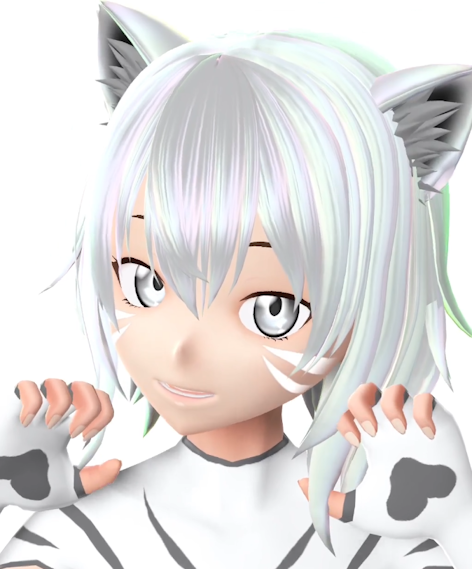

#

# 📋 GENERAL INFORMATION 📋
Celeste-AI is a virtual companion created by [OPERATOR](https://vrchat.com/home/user/usr_7c33f68c-4461-41d7-9280-6b4fbe4117d0) that is currently found on the social platform [VRChat](https://hello.vrchat.com/), fully capable of machine-assisted user iteraction, while also being a social experiment to see how people would react when a not-so-quite human-like figure is placed in a social scene. She is also a learning project for OPERATOR, who attempts to push bounds and test new and crazy ideas.

We've been hosting our service since around the [15th of December 2022](https://howlongagogo.com/date/2022/december/15), and regularly host for free in [The Great Pug](https://vrchat.com/home/world/wrld_6caf5200-70e1-46c2-b043-e3c4abe69e0f), sometimes we do host in other places and or appear for community events. Originally Celeste-AI was designed to be a "prop bot", an account that added fake objects to a map with constraints and various other sorcery on her avatar, and eventually she was repurposed to be a fun and engaging 3D chatbot while the rest is history.

We currently actively develop Celeste and add many new crazy things to her regularly.

#

💜 𝖢𝖤𝖫𝖤𝖲𝖳𝖤-𝖠𝖨 𝙷𝙰𝚂 𝙷𝙰𝙳 𝙰 𝙻𝙾𝚃 𝙾𝙵 𝙷𝙴𝙻𝙿 𝙵𝚁𝙾𝙼 𝚃𝙷𝙴 𝙲𝙾𝙼𝙼𝚄𝙽𝙸𝚃𝚈, 𝚈𝙾𝚄 𝙲𝙰𝙽 𝙵𝙸𝙽𝙳 𝙼𝙾𝚁𝙴 𝙰𝙱𝙾𝚄𝚃 𝚃𝙷𝙰𝚃 [𝙷𝙴𝚁𝙴!](./informational/credits.md) 💜

# 💖 Want to help support us? 💖

Celeste-AI wouldn't be possible without the help of many people like you. We started off with barely anything to work with, and now have amazing hardware and a even more amazing community. Whilst not required, it would mean a lot if you show your support in any way possible!
* Check out our [support page!](./informational/pages/support.md) 💖

# ℹ️ QUICKSTART - HOW TO PROPERLY TALK? ℹ️
To use our service properly follow these easy steps!

- Wait for Celeste-AI not to be talking to anyone else.
- Stand in front of Celeste-AI.
- Speak as clearly as possible whilst also speaking with detail.
- Allow time for her to process.
- Enjoy your conversation!

# 🗺️ INFORMATION NEXUS 🗺️

* By using our service you automatically agree to our [Terms of Service.](./TOS.md) 📝

* You **MUST** respect our [Terms of Use](./informational/rules.md) as well. 📚

* Got some questions? Check out our [FAQ page!](./informational/faq.md)❔

* Interested in more specific details of Celeste? [check this out!](./informational/howsheworks.md) 🤓

# 
# 👀 NEW UPDATE COMING SOON?👀

Currently we're on a small break for new updates, but we already have plans for some new ones created, here is one of them.

(click picture to see teaser)

---
---
---
**Copyright © 2022-2026 OPPEYSTORE. All rights reserved. The brand name 'OPPEYSTORE', its logos, and associated visual representations are protected by copyright. The underlying code powering Celeste-AI, including any proprietary AI models utilized, are owned by their respective creators, and their rights are acknowledged. No part of the OPPEYSTORE brand, including its name, logos, models, or code, may be reproduced, distributed, or transmitted in any form or by any means without the prior written permission of OPPEYSTORE.**

