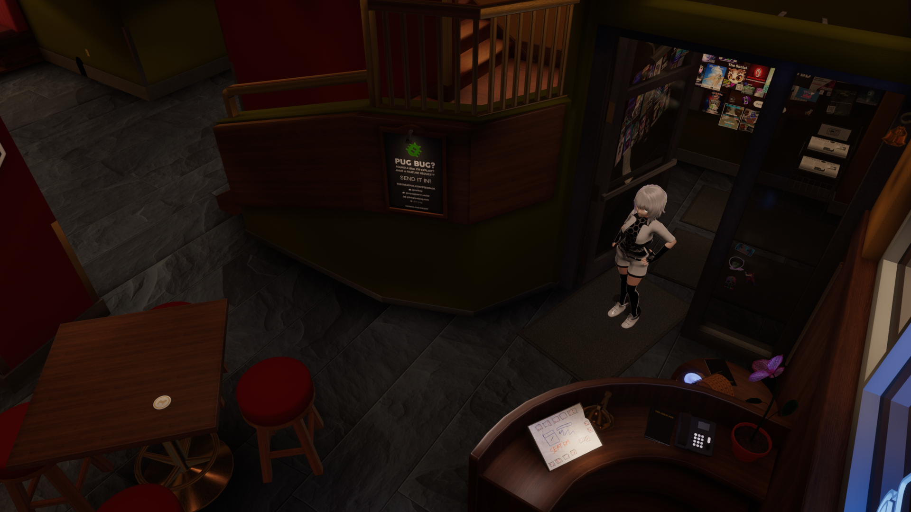

#

#
[>>> CONSIDER SUPPORTING OUR PROJECT!!](../../informational/pages/support.md) 💖

# [Action-System]

😘 How does this system currently work?

 

1.  **Actionary System Basics**:
This system allows celeste to run custom code under random conditions or extremely specific situations, be it for general-case or map-specific code, this is more useful for times when we want to **COMPLETELY** overwite celestes behavior under set conditionals, or by chance.

2.  **Forced Action**:
Only one action can be played at a time, unlike events from the [event-system](./events.md) which stack by priority, all other functionality will halt until the action is completed, will naturally return to default action apon completion.

3.  **Early cancellation possible.**:
Under specific situations this system can have its effects cancelled early.

#

# [ALL GENERAL ACTIONS]
## [Default]

#
**[CONDITIONS]**:

⚠️ **This is the default "action" when nothing else is selected.**

⚠️ **Will always activate by default and when other actions are completed will be re-ran.**

#
**[WHAT DOES THIS DO?]**:

Does baseline functionality, stayin and chillin.

>**[RETURNS]**: **Comedy**

#

## [RefreshGame]

#
**[CONDITIONS]**:
* Spawn into instance.
* Five real life hours pass.

#
**[WHAT DOES THIS DO?]**:

Forces the game to restart and rejoin the current lobby, gives us a fresh gamelog, and various other cleanup.

>**[RETURNS]**: **None**

---
---
---