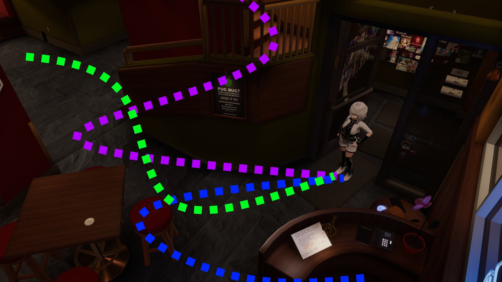

#

#
[>>> CONSIDER SUPPORTING OUR PROJECT!!](../../informational/pages/support.md) 💖

# [Event-System]

😘 How does this system currently work?

 

1.  **Event system basics**:
This system allows celeste to run custom code with a priority system in mind, this means that events with higher priority will run first compared to lower priority ones, this is good for when we want to passively run code and display things to people without completely overwriting her other behavior.

2.  **Priority based events**:
Only one event can be ran at a time, however celeste will keep running events in succession till the event list is empty, then she will be able to go into standard operation mode.

3.  **Early cancellation possible.**:
Under specific situations this system can have its effects cancelled early.

#

# [ALL CURRENT EVENTS POSSIBLE]
## [Inference]

#
**[CONDITIONS]**:
* Someone interacts with Celeste-AI by speaking infront of her.
* Spoken to her within her alotted time.
#
**[WHAT DOES THIS DO?]**:

Starts the process of generating a response towards a person who has spoken to her, first she checks the users input which was created by the transcriber, if the user has not broken any of our simple filters and our secondary ai filter, we will proceed to go into the "thinking-phase".

Animation changes if she fails a inference request, until a outcome is decided.

**[ALL OUTCOMES]**:

#
* **[RESPONDED]** ✅
in this situaton she will generate a textual split if neccessary and calculate the proper emotions ahead of time, this also includes applying memory of what the user said and or what she has responded with, she will also start the tts-voice-pregeneration process in the background.

>**[RETURNS]**: **Speak**
#
* **[FILTERED]**  ❎
She has determined that what the person talking to her said is "toxic" and has filtered it, she will proceed to warn the system to combine the audio and visual buffer into a video file and warn the moderators of our service.
>**[RETURNS]**: **Toxicity**
#
* **[FAILED-TO-RESPOND]**  ❎
Seems celeste was not able to generate a proper response due to failing too many times, usually because she broke her own filter or did not meet minimal requirements in her responses.
>**[RETURNS]**: **FailedGeneration**

## [Toxicity]

#
**[CONDITIONS]**:
* Trip word blacklist.
* Trip secondary ML filter.
#
**[WHAT DOES THIS DO?]**:

Informs to the user she will not respond to them regarding their query, also informs moderators in the background.

>**[RETURNS]**: **None**

## [FailedGeneration]

#
**[CONDITIONS]**:
* Failed to generate a proper response to a user query because she said blacklisted words too many times.
* Failed to generate a proper response to a user query because she tripped the secondary filter too many times.
#
**[WHAT DOES THIS DO?]**:

This event plays because she failed to generate a response, this is a visual event.

>**[RETURNS]**: **None**

## [SpeakEvent]

#
**[CONDITIONS]**:
* Requested by system.
#
**[WHAT DOES THIS DO?]**:

Displays emotional facial and bodily animations and also responds to the player with the current TTS voice.

Plays up to [3] unique animations depending on how many "turns" the bot has to take to speak, if there are more chat turns than 3 it will continue using the last animation on whatever set its using.

⚠️ **In the future we plan to expand this system with way more animations, currently all hand animations default to the 'neutral' animation set.**

For more information about the emotional system [click here](../pages/emotions.md)!

>**[RETURNS]**: **None**

## [TookToLong]

#
**[CONDITIONS]**:
* Reach max allowed time to speak.
#
**[WHAT DOES THIS DO?]**:

Inform user they need to hurry the fuck up, and gives you random one-liners to let you know how annoying you are.

>**[RETURNS]**: **None**
## [FriendRequest]

#
**[CONDITIONS]**:
* Become her friend!
#
**[WHAT DOES THIS DO?]**:

Celebrates making a new friend, up to 10 at a time!

Announces each friend and tries to pronounce their name if possible, whilst
also giving a quippy remark depending on how many were added.

>**[RETURNS]**: **Friendship & Love**

#
## [PlaySound]

#
**[CONDITIONS]**:
* Someone asked her to play a sound.
#
**[WHAT DOES THIS DO?]**:

Visual helper that celeste runs when a sound command is ran.

>**[RETURNS]**: **None**
#

## [Ramble]

#
**[CONDITIONS]**:
* 🎲 **Selected randomly while idling.**

#
**[WHAT DOES THIS DO?]**:

Randomly self inference itself, with a randomized topic, remembers what its talking about so it can be questioned about it if you so choose.

>**[RETURNS]**: **None**
#

## [randomMove]

#
**[CONDITIONS]**:
* ⚠️ **Disabled if there is no pathfinding grid.**
* 🎲 **Selected randomly while idling.**

#
**[WHAT DOES THIS DO?]**:

Requests a **AMPath** from the [**AMWALKER system**](../pages/traversal.md) randomly selecting a spot to move to.

* Chooses to randomly select a specialnode on the map, and has a slight chance to look for the furthest instead.

* Will randomly decide to walk, crouch, or run to its destination.

* If already at a special node, excludes it from random selection.

>**[RETURNS]**: **None**

---
---
---